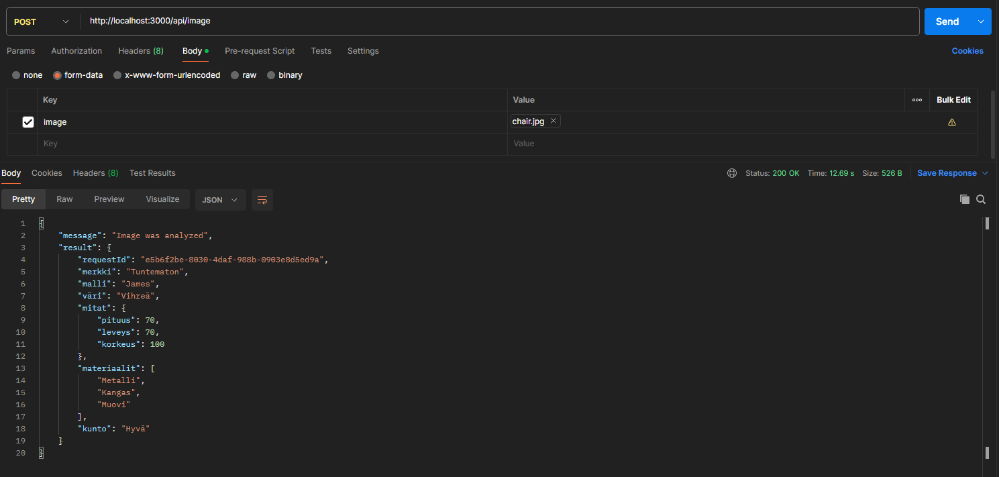
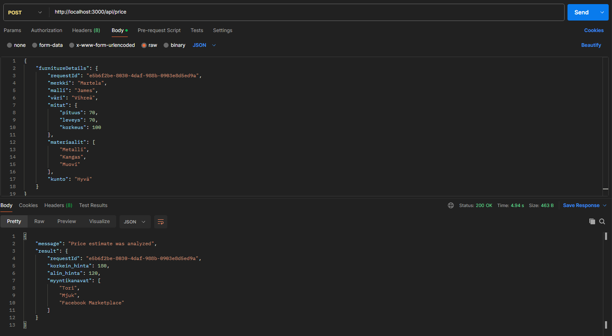
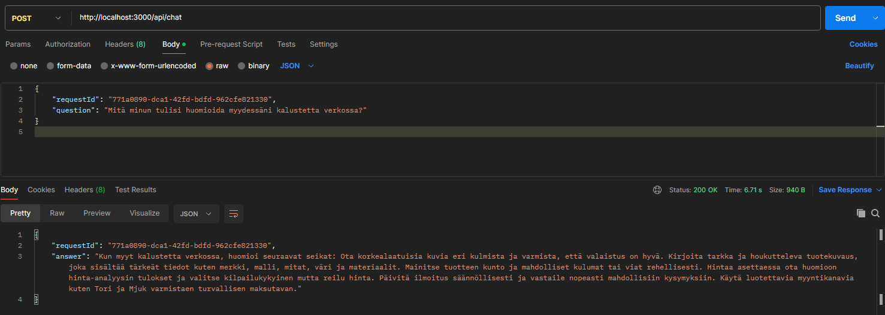
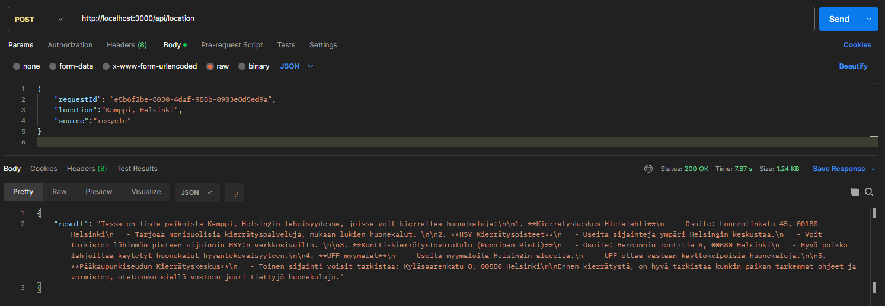
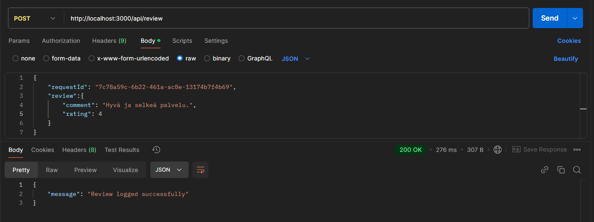
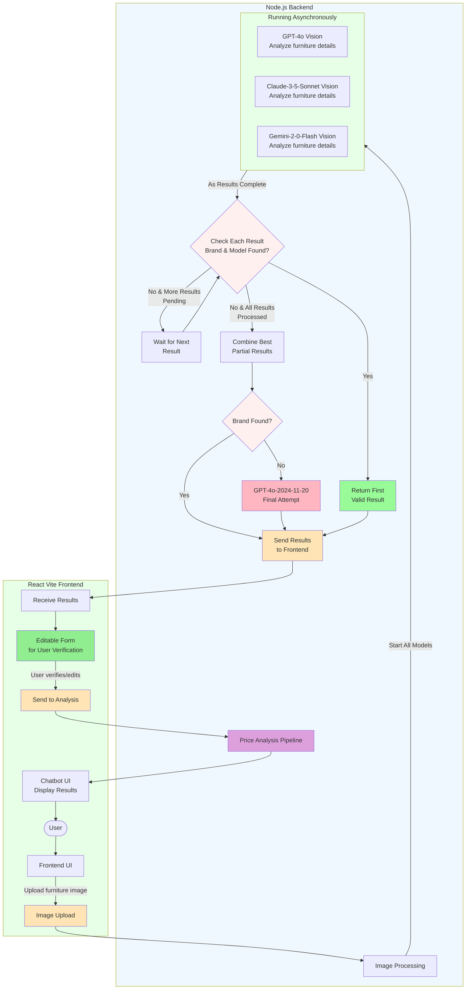
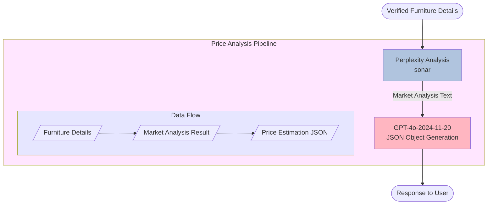

# kaluste-backend

⚠️ **WARNING: This documentation is outdated and corresponds to git TAG v1.0. The codebase has evolved significantly since this version. Only section [Vision Pipeline](#vision-pipeline) and text after it is up to date. Please refer to the latest code for other implementation details.**

Älyä-hankkeessa KalusteArvio-projektin palvelin ja tekoälyliittymät

## Table of Contents

- [Technologies](#technologies)
- [Installation](#installation)
- [API Documentation](#api-documentation)
- [Docker Instructions](#docker-instructions)
- [Cache](#cache)
- [Database](#database)

## Technologies

- TypeScript
- Node.js
- Express.js
- OpenAI API
- SerpApi API
- MongoDB
- Docker
  
## Installation

### Enviromental variables

Create an .env file in the root folder with the following values (use the .env.example file for reference):

- OPENAI_API_KEY
- MONGODB_URI
- PORT
- ANTHROPIC_API_KEY
- SERPAPI_API_KEY
- JWT_SECRET


### Initialize server

```
npm run i
```

#### Run in development mode

```
npm run dev
```

#### Run in production mode

```
npm run build
npm run start
```

## API Documentation

### Roadmap

📷 Taken Photo → /api/photo → /api/image → /api/price → /api/evaluation/check ⇄ /api/evaluation

### Route details

Below is a list of available API endpoints in this project, grouped by functionality.

| HTTP | Route | Description                                      |
| ---- | ----- | ------------------------------------------------ |
| GET  | /ping | Sends a request to validate the server is running |

| HTTP | Route | Description                                      | 
| ---- | ----- | ------------------------------------------------ |
| POST  | /api/photo | Analyzes the uploaded image quality. Returns a message indicating whether the photo is good or should be retaken. Send an image in raw binary format using HTML multipart/form-data |

| HTTP | Route      | Description                                                                                                                                                  |
| ---- | ---------- | ------------------------------------------------------------------------------------------------------------------------------------------------------------ |
| POST | /api/image | Sends the image to the AI for analysis. Returns initial form data including detected brand/model, furniture details and estimated price reasoning. The suggested price is not editable via the UI at the analysis step. Send an image in raw binary format using HTML multipart/form-data. Key must be "image" and the image itself as value to recieve an analysis of the furniture |

| HTTP | Route      | Description                                                                                                                                                  |
| ---- | ---------- | ------------------------------------------------------------------------------------------------------------------------------------------------------------ |
| GET | api/image/:id | This endpoint returns the image based on its ID. The ID is from the 'imageId' field inside the evaluation object |

| HTTP | Route      | Description                                                                                                                                                  |
| ---- | ---------- | ------------------------------------------------------------------------------------------------------------------------------------------------------------ |
| POST | /api/evaluation/check | Checks whether the furniture is needed in stock based on the brand/model and if not AI will check it via furniture details and image. Returns a message indicating demand status to the user. Send brand and model, other furniture details and image in the request body to receive message if furniture is needed |


### CRUD operations for storing, updating, or removing furniture item data in the database

| HTTP | Route      | Description                                                                                                                                                  |
| ------ | ------------- | ------------------------------------------------------------------------------------------------------------------------------------------------------------ |
| GET  | /api/evaluation/all | Gets all furniture item data from database |

| HTTP | Route      | Description                                                                                                                                                  |
| ------ | ------------- | ------------------------------------------------------------------------------------------------------------------------------------------------------------ |
| POST | /api/evaluation/save | Saves all furniture item data to the database |

| HTTP | Route      | Description                                                                                                                                                  |
| ------ | ------------- | ------------------------------------------------------------------------------------------------------------------------------------------------------------ |
| PUT  | /api/evaluation/:id | Updates furniture item data |

| HTTP | Route      | Description                                                                                                                                                  |
| ------ | ------------- | ------------------------------------------------------------------------------------------------------------------------------------------------------------ |
| DELETE | /api/evaluation/:id | Removes furniture item data from database |

| HTTP | Route      | Description                                                                                                                                                  |
| ------ | ------------- | ------------------------------------------------------------------------------------------------------------------------------------------------------------ |
| PATCH  | api/evaluation/:id/status | Updates only the status field of an evaluation. Accepted statuses: "not reviewed", "reviewed", "archived" |


### CRUD operations for list of brands or models selected by an expert in the database

| HTTP | Route      | Description                                                                                                                                                  |
| ------ | ------------- | ------------------------------------------------------------------------------------------------------------------------------------------------------------ |
| GET  | /api/expertSelectedBrand/all | Gets all expert-selected brands and models |

| HTTP | Route      | Description                                                                                                                                                  |
| ------ | ------------- | ------------------------------------------------------------------------------------------------------------------------------------------------------------ |
| POST | /api/expertSelectedBrand/add | Adds a new brand or model entry to the expert-selected list |

| HTTP | Route      | Description                                                                                                                                                  |
| ------ | ------------- | ------------------------------------------------------------------------------------------------------------------------------------------------------------ |
| PUT  | /api/expertSelectedBrand/update/:id | Updates an existing entry (brand and/or model) by ID |

| HTTP | Route      | Description                                                                                                                                                  |
| ------ | ------------- | ------------------------------------------------------------------------------------------------------------------------------------------------------------ |
| DELETE | /api/expertSelectedBrand/delete/:id | Removes an expert-selected entry by ID |

### Authentication

| HTTP | Route      | Description                                                                                                                                                  |
| ------ | ------------- | ------------------------------------------------------------------------------------------------------------------------------------------------------------ |
| POST  | /api/login | Authenticates a user by username and password and returns a JWT token  |

| HTTP | Route      | Description                                                                                                                                                  |
| ------ | ------------- | ------------------------------------------------------------------------------------------------------------------------------------------------------------ |
| POST | /api/register | Registers a new user account |

| HTTP | Route      | Description                                                           |
| ---- | ---------- | --------------------------------------------------------------------- |
| POST | /api/users/:id/role | Admin-level endpoint to update users role |


### Available routes but not in use in UI

| HTTP | Route         | Description                                                                                                                                           |
| ---- | ------------- | ---------------------------------------------------------------------------------------------------------------------------------------------------------------------------------------------- |
| POST | /api/location | Send the user location coordinates and the AI will find locations where the user can perform recycle to the piece of furniture |

| HTTP | Route      | Description                                                           |
| ---- | ---------- | --------------------------------------------------------------------- |
| POST | /api/price | Separates pricing logic from the image parsing flow. Send SerpApi result with brand and model, other furniture details and image in the request body to receive price estimates |


### Requests and Responses

> #### /api/image
>
> 

> #### /api/price
>
> 

> #### /api/chat
>
> 

> #### /api/location
>
> 

> #### /api/review
>
> 

## Docker Instructions

### Using Dockerfile

#### Build Docker Image

To build the Docker image, run the following command in the root directory:

```sh
docker build -t kaluste-backend .
```

#### Run Docker Container

```sh
docker run -d --name kaluste-backend -p 3000:3000 --env-file .env kaluste-backend
```

#### Stop Docker Container

To stop the Docker container, use the following command:

```sh
docker stop kaluste-backend
```

#### Remove Docker Container

To remove the Docker container, use the following command:

```sh
docker rm kaluste-backend
```

### Using Docker Compose

#### docker-compose-be-cache.yml

This file is used to set up and run both the backend and Memcached services.

To build and run the containers, use the following command:

```sh
docker-compose -f docker-compose-be-cache.yml up
```

To stop the running containers, use the following command:

```sh
docker-compose -f docker-compose-be-cache.yml down
```

#### docker-compose-local-cache.yml

This file is used to set up and run only the Memcached service. Note: Remove `MEMCACHED_HOST` from `.env` or set it to `localhost` for this to work.

To build and run the Memcached container, use the following command:

```sh
docker-compose -f docker-compose-local-cache.yml up
```

After the Memcached container is running, run the backend locally:

```sh
npm run dev
```

To stop the running Memcached container, use the following command:

```sh
docker-compose -f docker-compose-local-cache.yml down
```

## Cache

We use [Memcached](https://memcached.org/) for caching in development.

### Key Features

- Caches furniture price data using `brand+model` as key
- 24 hour cache expiration
- Checks cache before new price scrapes
- Cache clears on server restart

### Setup

- Follow Docker Instructions to setup Memcached.

Note: Caching is currently disabled in production.

## Database

This project uses [MongoDB](https://www.mongodb.com/) as its database solution and [mongoose](https://mongoosejs.com/) to interact with MongoDB.

### Main Functionalities

1. Conversation Logging

   - Stores chat interactions between users and AI
   - Endpoint: `/api/chat`
   - Records full conversation history

2. Review Logging
   - Stores user feedback and reviews
   - Endpoint: `/api/review`

### Database Schema

The schema for the database documents is declared in the [log.ts](/src/models/log.ts) file.

## Vision Pipeline

> **Note**: This section is up to date. _Last updated: January 3, 2025_

The Vision Pipeline process works as follows:

1. User uploads a furniture image through the Frontend UI
2. Image is processed and sent to multiple AI vision models in asynchronously:
   - GPT-4o
   - Claude-3-5-Sonnet
   - Gemini-2-0-Flash
3. As each model completes analysis:
   - If both brand and model are found, return that result immediately
   - If brand or model is missing but more results pending, wait for next result
   - If no complete results found and all results processed, combine best partial results
4. If brand is still missing after combining results, make final attempt with GPT-4o-2024-11-20 which has been specifically instructed to provide its best guess for at least the brand
5. Present results in editable form for user verification
6. After user verification, proceed to Price Analysis Pipeline



## Price Analysis Pipeline

The price analysis process uses Perplexity AI and GPT-4o to generate market-based price estimations for furniture. Here's how the price analysis pipeline works:

1. After furniture details are verified by the user, they are sent to Perplexity AI
2. Perplexity analyzes the furniture details and produces a market analysis
3. The market analysis is processed by GPT-4o, which generates a structured JSON response
4. The price estimation is returned directly to the user



## To Developer

### Environment Setup

Remember to set environment variables:

```bash
cp .env.example .env
```

### Rahti Production Environment

Application has been published to Rahti following [this deployment guide](https://github.com/laguagu/arvolaskuri-node-backend?tab=readme-ov-file#sovelluksen-julkaisu-csc-rahti-2ssa-github-integraatiolla).

## Lisenssi

License - katso [LICENSE](LICENSE) tiedosto lisätietoja varten.
